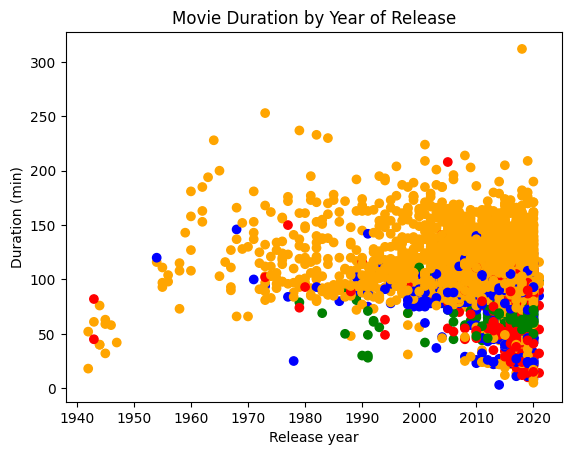

# Investigating-Netflix-Movies
In this project, I utilize pandas and matplotlib to investigate a Netflix movie data set to determine if movie durations are becoming shorter over time. The result is displayed in a scatter plot.

**Netflix**! What started in 1997 as a DVD rental service has since exploded into one of the largest entertainment and media companies.

Given the large number of movies and series available on the platform, it is a perfect opportunity to flex your exploratory data analysis skills and dive into the entertainment industry. Our friend has also been brushing up on their Python skills and has taken a first crack at a CSV file containing Netflix data. They believe that the average duration of movies has been declining. Using your friends initial research, you'll delve into the Netflix data to see if you can determine whether movie lengths are actually getting shorter and explain some of the contributing factors, if any.

You have been supplied with the dataset `netflix_data.csv` , along with the following table detailing the column names and descriptions:

## The data
### **netflix_data.csv**
| Column | Description |
|--------|-------------|
| `show_id` | The ID of the show |
| `type` | Type of show |
| `title` | Title of the show |
| `director` | Director of the show |
| `cast` | Cast of the show |
| `country` | Country of origin |
| `date_added` | Date added to Netflix |
| `release_year` | Year of Netflix release |
| `duration` | Duration of the show in minutes |
| `description` | Description of the show |
| `genre` | Show genre |

## Movie Durations by Year of Release | Scatterplot
I assigned colors to the genre row within the Netflix movie dataset. The Children genre is assigned the color blue, the Documentaries genre is assigned the color red, the Stand-Up genre is assigned the color green, and for all other genres the color assigned is orange. The scatterplot shows the duration of a movie on the y-axis and the release year on the x-axis. The scatterplot shows that we can't be certain if movie durations are getting shorter.

